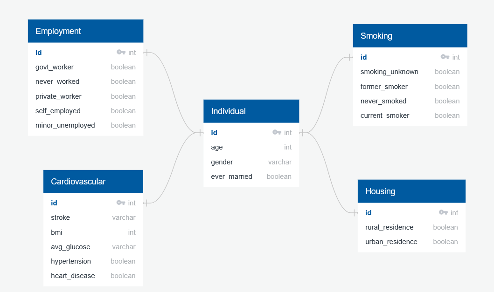
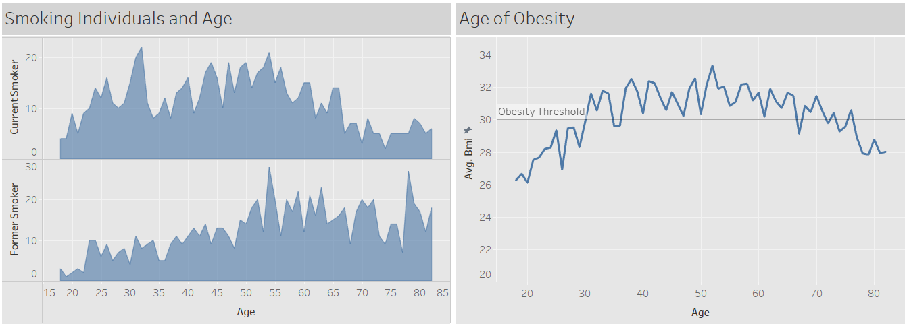
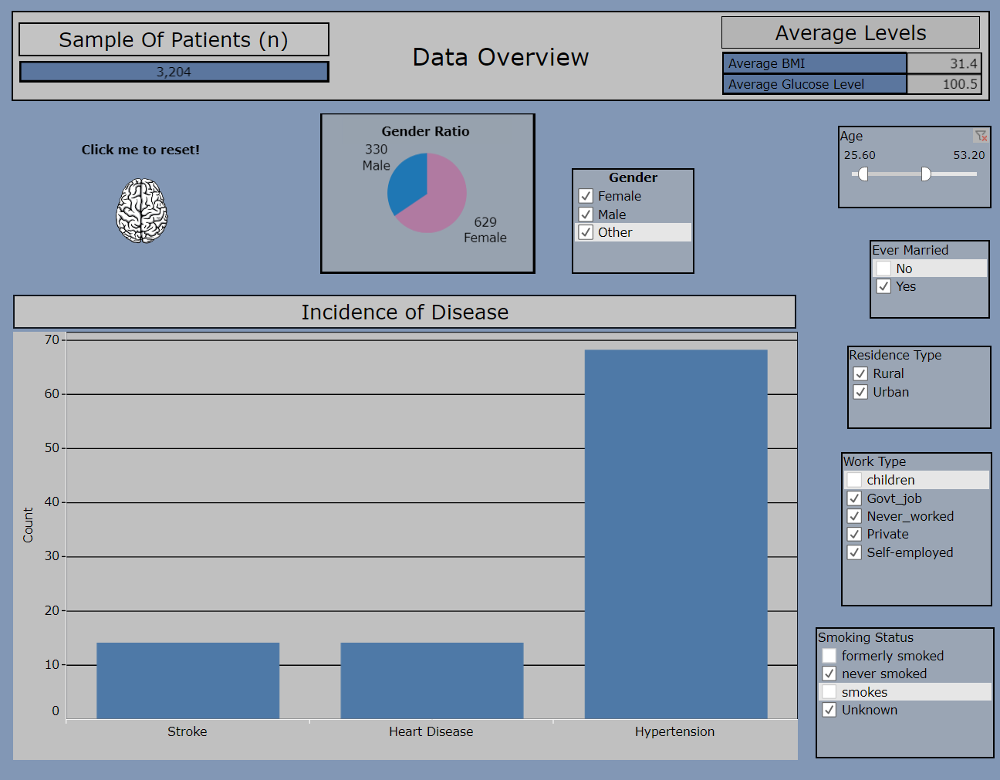

# Predicting Brain Stroke using Machine Learning algorithms

## Topic

Using a machine learning algorithm to predict whether an individual is at high risk for a stroke, based on factors such as age, BMI, and occupation.

## Reason for topic

Strokes are a life threatening condition caused by blood clots in the brain, and the likelihood of these blood clots can increase based on an individual's overall health and lifestyle. Accurately predicting whether an individual may have a stroke could help save lives. We were also interested in seeing if there were any individual factors that are better at predicting strokes than others.

## Source data

A Kaggle dataset of over five thousand people, which has already been slightly preprocessed: https://www.kaggle.com/datasets/zzettrkalpakbal/full-filled-brain-stroke-dataset

## Data cleaning and exploratory analysis 

* healthcare-dataset-stroke-data.csv was read into Data Extraction.ipynb as a Pandas DataFrame
* Columns where the BMI value was "NaN" were dropped from the DataFrame
* Columns where the data values were strings were encoded into numerical form, both manually and through the Pandas get_dummies() method
* The names for the dummy columns were simplified
* To find the youngest stroke patient in the dataset, we filtered the DataFrame for ages below certain thresholds, until we determined that there was only one stroke patient below the age of 20
* We decided that any data for non-adult individuals may be redundant for our analysis, since there was only one child who had a stroke, so we filtered the DataFrame for individuals above the age of 17
* The DataFrame of only adults was exported to adult.csv

## Questions

* Can we create a machine learning model that can accurately predict a possible stroke?
* Which category of variable is the best predictor of a stroke (cardiovascular, employment, housing, smoking)?
* Can we predict a stroke based on an individual's BMI?

## Machine Learning Segment 1

At the conclusion of segment 1 of this project we have tried several different machine learning models with this dataset (RandomForestClassifier, BalancedRandomForestClassifier, LogisticRegression, and Neural Network). It appears we will be picking Neural Networks as this model has given us the highest accuracy thus far, but that could be subject to change pending any developments. A challenge we are working on is the prevelance of the "False Negatives" which all models we tested have. When predicting a Stroke, a false negative result is not desired. After running the Neural Network model on the dataset which was encoded w/ pd.get_dummies, we ran it again using the OneHotEncoder to encode the categorical values. The get_dummies provided a higher accuracy and lower loss than the data which was encoded with OneHotEncoder. Additionally, using the RandomForest model, we were able to graph the feature importances which was informative. 

## Machine Learning Segment 2

Due to the issues involving the prevalence of False Negatives, we revisited the data preprocessing stage. False negatives, when predicting strokes, are not an acceptable outcome. We binned the "age", "avg_glucose_level", "bmi" columns and then applied OneHotEncoder to each and merged them back in to the dataframe. We then re-ran the algorithms (RandomForestClassifier, LogisticRegression, and Neural Network). The performance improved slightly, but the issues with the false negative was still there. At this point, in lieu of binning/applying OHE to the "age", "avg_glucose_level", "bmi" columns we decided to scale them using StandardScaler. This was done due to the documented research which shows the practice of OneHotEncoding values is not ideal for tree based models at it can skew the branches towards the 0's. Once this was completed, we then checked the balance and saw the "y" values were heavily imbalanced, with many more 0's (no stroke) than 1's (stroke). To combat this, we used the SMOTE oversampling method. Once the X,y values were resampled and balanced, we split the dataset using TrainTestSplit. We then implented the RandomForestClassifier which showed promising results after examining the confusion matrix, accuracy, precision, recall, and sensitivity scores. Also of note, is that after graphing the feature importances it was discovered the "never_worked" column held no significance so this column was removed. We then implemented the LogisticRegression and Neural Network models we built, also with improved results, however the RandomForest performed the best. Due to all of this, we will be using the RandomForest model which showed superior predictability and performance. See code [here](./Machine_Learning_segment_2.ipynb).

While attempting to create visualizations of our data in Tableau using the individual CSV files for feature categories (cardiovascular, housing, etc.) we discovered that there were potential outliers or incorrect data entries for BMI, as there was a few individuals with a BMI over 80 and at least one over 90, which seems physically impossible. This may be of interest to us for further data cleaning.

# Machine Learning Model Scores

* Training score: 1.0
* Testing score: 0.943
  * This represents the accuracy of the model. An accuracy score of 94% is quite impressive and is acceptable for this model and its purpose of predicting strokes in patients.
* Precision: 0.916
* Sensitivity: 0.974
* F1: 0.944

## Database integration

We have used a mix of Amazon Web Services and pgAdmin to host and manage out database. 

## Dashboard

We used Tableau public for our dashboard to provide readers with an optimal way to process and vizualize variables. 

Our Data Overview page features interactive, filterable charts showing the prevalence of stroke, heart disease, and hypertension in certain categories of patients, as well as their gender ratio and average BMI and glucose level. The user can select one or more filters for each of the features, and age range can be selected using a slider. The filters can be reset by clicking on the brain in the top left corner.

## Presentation

https://docs.google.com/presentation/d/1-EMkQBdRliM5cLLdU_7Ve7CPMNUqh6q24eofqfjCJfs/edit?usp=sharing

## Citations

Fedesoriano. “Stroke Prediction Dataset.” Kaggle, 26 Jan. 2021, Retrieved September 10, 2022, from
https://www.kaggle.com/datasets/fedesoriano/stroke-prediction-dataset. 

“About Stroke.” Centers for Disease Control and Prevention, Centers for Disease Control and Prevention, 4 May 2022, Retrieved September 10, 2022, from
https://www.cdc.gov/stroke/about.htm. 

Mayo Foundation for Medical Education and Research. (2021, July 1). High blood pressure (hypertension). Mayo Clinic. Retrieved September 10, 2022, from https://www.mayoclinic.org/diseases-conditions/high-blood-pressure/symptoms-causes/syc-20373410

