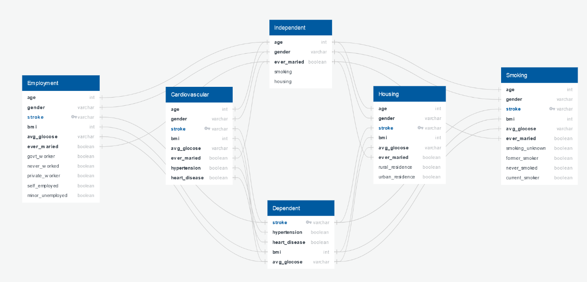

# Predicting Brain Stroke using Machine Learning algorithms

## Topic

Using a machine learning algorithm to predict whether an individual is at high risk for a stroke, based on factors such as age, BMI, and occupation.

## Reason for topic

Strokes are a life threatening condition caused by blood clots in the brain, and the likelihood of these blood clots can increase based on an individual's overall health and lifestyle. Accurately predicting whether an individual may have a stroke could help save lives. We were also interested in seeing if there were any individual factors that are better at predicting strokes than others.

## Source data

A Kaggle dataset of over five thousand people, which has already been slightly preprocessed: https://www.kaggle.com/datasets/zzettrkalpakbal/full-filled-brain-stroke-dataset

## Data cleaning and exploratory analysis 

* healthcare-dataset-stroke-data.csv was read into Data Extraction.ipynb as a Pandas DataFrame
* Columns where the BMI value was "NaN" were dropped from the DataFrame
* Columns where the data values were strings were encoded into numerical form, both manually and through the Pandas get_dummies() method
* The names for the dummy columns were simplified
* To find the youngest stroke patient in the dataset, we filtered the DataFrame for ages below certain thresholds, until we determined that there was only one stroke patient below the age of 20
* We decided that any data for non-adult individuals may be redundant for our analysis, since there was only one child who had a stroke, so we filtered the DataFrame for individuals above the age of 17
* The DataFrame of only adults was exported to adult.csv

## Questions

## Communication protocol among team members

- Meet at arranged times using Discord to collaborate

- Slack ideas/questions during off hours

- Use Bootcamp class time to collaborate

## Provisional machine learning model

At the conclusion of segment 1 of this project we have tried several different machine learning models with this dataset (RandomForestClassifier, BalancedRandomForestClassifier, LogisticRegression, and Neural Network). It appears we will be picking Neural Networks as this model has given us the highest accuracy thus far, but that could be subject to change pending any developments. A challenge we are working on is the prevelance of the "False Negatives" which all models we tested have. When predicting a Stroke, a false negative result is not desired. After running the Neural Network model on the dataset which was encoded w/ pd.get_dummies, we ran it again using the OneHotEncoder to encode the categorical values. The get_dummies provided a higher accuracy and lower loss than the data which was encoded with OneHotEncoder. Additionally, using the RandomForest model, we were able to graph the feature importances which was informative. 

## Database integration

We plan on intergrating our data frame into postgressSQL. This is the initial rough draft of our EBD. 

